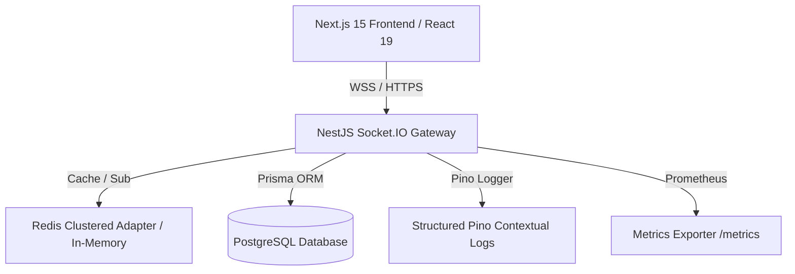

# 🚀 Real-Time Enterprise Quiz Platform (`live_io`)


A production-grade, high-concurrency real-time Kahoot-style quiz platform built with **NestJS**, **Socket.IO**, **Prisma**, **PostgreSQL**, **Redis**, and **Next.js**. Tested and verified under **1,000+ concurrent players** with zero connection failures and sub-second real-time state synchronization.

---

## 🏗 System Architecture



---

## 📚 Operational & CI/CD Documentation

- 🔄 [CI/CD Pipeline Architecture & 20-Stage Workflow](docs/CI_CD.md)
- 🚀 [Deployment & Emergency Rollback Procedures](docs/DEPLOYMENT.md)
- 💻 [Local Development & Testing Guide](docs/LOCAL_DEVELOPMENT.md)
- 🔑 [Environment Variables Reference](docs/ENVIRONMENT_VARIABLES.md)
- 🔒 [GitHub Repository Secrets Guide](docs/GITHUB_SECRETS.md)

---

## ⚡ Quick Start (Local Development)

```bash
# 1. Clone Monorepo & Install Dependencies
git clone https://github.com/prajwal-nikhar/live_io.git
cd live_io
npm install && cd backend && npm install && cd ../frontend && npm install --legacy-peer-deps && cd ..

# 2. Run Tests with Coverage Check
npm run test:coverage

# 3. Start Backend & Frontend Dev Servers
npm run start:dev --prefix backend
npm run dev --prefix frontend
```
