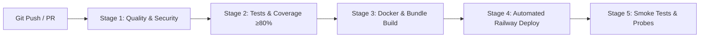

# 🔄 CI/CD Pipeline Documentation

This document describes the automated 20-stage GitHub Actions CI/CD pipeline powering the Real-Time Quiz Platform.

---

## 🎯 Pipeline Architecture

---

## 🚀 Pipeline Stages & Jobs

### Job 1: Quality, Types & Security Audit (`quality-and-security`)

1. **Checkout Repository**: Uses `actions/checkout@v4`.
2. **Setup Node.js 20 LTS**: Configures Node 20 runtime with npm dependency caching.
3. **Install Dependencies**: Runs `npm ci` for root, backend, and frontend.
4. **Code Quality Linting**: Runs `npm run lint` across backend and frontend.
5. **Prettier Format Check**: Verifies zero formatting deviations (`npx prettier --check`).
6. **TypeScript Strict Type Checking**: Transpiles backend and frontend without type errors.
7. **Dependency Vulnerability Scan**: Scans for high/critical npm package vulnerabilities via `npm audit`.
8. **Secret Scanning**: Runs Trufflehog secret scanner to ensure no API keys or credentials exist in git history.

### Job 2: Test Automation & Coverage (`test-and-coverage`)

9. **Prisma Schema Validation**: Validates database schema (`npx prisma validate`).
10. **Unit & Integration Tests**: Executes Jest unit test suite across modules.
11. **Coverage Threshold Enforcement**: Verifies code coverage satisfies **≥80% statements, lines, functions**.
12. **Coverage Artifact Upload**: Saves HTML & LCOV reports as GitHub Actions build artifacts.

### Job 3: Build & Docker Image Verification (`build-and-docker`)

13. **Backend Build**: Transpiles NestJS backend into dist bundle.
14. **Frontend Build**: Builds Next.js production bundle.
15. **Backend Docker Build**: Compiles `Dockerfile.backend` (multi-stage, non-root `node` user).
16. **Frontend Docker Build**: Compiles `Dockerfile.frontend` (multi-stage, production runner).

### Job 4: Railway Deployment (`deploy-to-railway`)

17. **Automated Trigger**: Fires automatically on `main` branch pushes after Jobs 1, 2, and 3 pass.
18. **Railway Deployment**: Deploys services using `RAILWAY_TOKEN` secret.

### Job 5: Verification & Smoke Probes

19. **Health Probes Verification**: Checks `/api/live`, `/api/ready`, `/api/health`.
20. **Automated Smoke Tests**: Runs `scripts/post-deploy-smoke-test.js` validating authentication, room creation, and WebSocket lifecycle.
