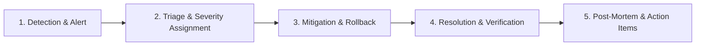

# 🚨 Incident Response & Escalation Workflow

Standard operating procedures for managing production incidents.

---

## 🔄 Incident Lifecycle Phases

---

## 👥 Escalation Roles

1. **Incident Commander (IC)**: Leads triage, delegates actions, and makes rollback decisions.
2. **Operations Lead**: Executes infrastructure, database, or Railway scaling commands.
3. **Communications Lead**: Updates status page and notifies stakeholders.

---

## 📝 Post-Mortem Requirements

Every P1/P2 incident requires a completed [INCIDENT_TEMPLATE.md](docs/INCIDENT_TEMPLATE.md) within 48 hours.
